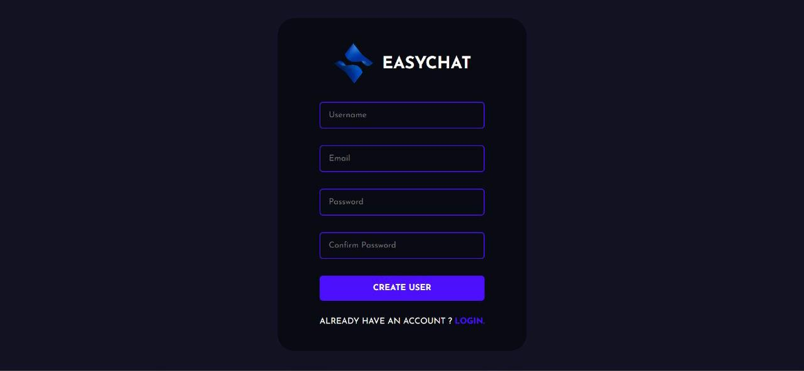
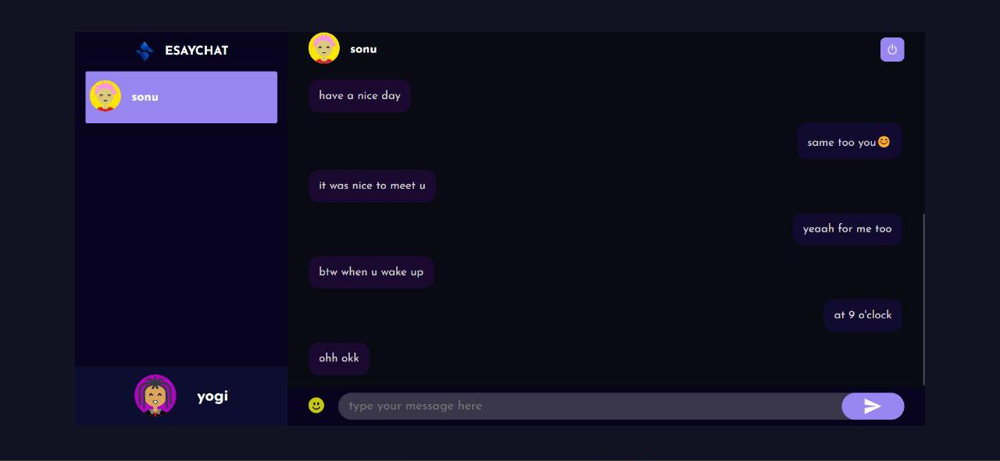

## Steps to Start the App

#### Install the Public Dependencies
#### Install the Server Dependencies
#### In the Server Directory there's a .env file. Change the value of mongodb inside the file. Set the value as your mongodb connection url.
#### Now start the server by yarn start
#### Now start the react by yarn start
#### And the chat application would be running successfully by now.

---

## About the EasyChat Application

- A place to share the information/thoughts.
- User can create an account, then login, do some chat and logout their accounts.

---

## Tech Stack Used

- Material UI: Styling & Icons
- MongoDB: For DataBase Management
- ExpressJs: For BackEnd Routing
- React: FrontEnd Developement
- NodeJS: For BackEnd developement
- Netlify: For hosting the frontEnd developement

---

## Previews

- Desktop Preview

- Mobile Preview

- User Details:

- Login Page:

- Create User:

- Showing Chats:

<!-- - SnackBar Alerts

 -->

